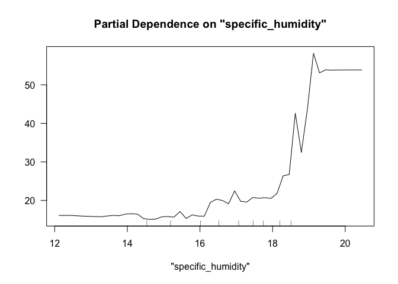
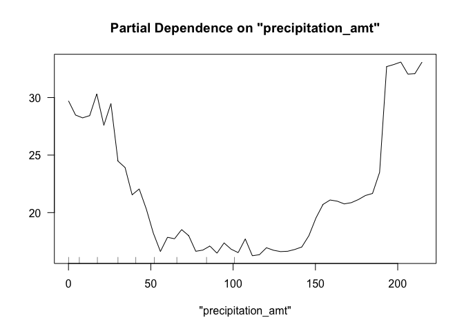

Author:

Shankai Liao

Xing Xin

Yiwen Wang

# Question 1

1.It does mean the correlation between “Crime” and “Police”, however,
does not automatically mean that the change in “Police” is the cause of
the change in the values of the “Crime”. Causation indicates that one
event is the result of the occurrence of the other event and the
direction between variables is single. Moreover, other characteristics
of different cities may also cause the change in the measure of crime
rate so it is hard to attribute causation into “Police”.

2.Researchers found a city Washington DC, where the stronger effect of
higher police officers is mainly because it is a terrorist target. In
this way, since the additional police power leads to lower crime rate,
they could conclude the causation association between “Police” and
“Crime”. Table 2 regresses daily crime totals against the terror alert
level. It is statistically significant coefficient at the 5% level and
indicates total crime rate decreases by an average of 7 crimes
approximately..

3.It aims to test whether there are fewer visitors on high-alert days
since metro ridership could be a good proxy for tourism. However, the
effect of the Metro ridership is small. Including logged mid-day Metro
ridership directly in the regression is able to verify that high-alert
levels are not being confounded with tourism levels.

4.Table 4 shows the change in crime on high-alert days for one specific
district (the national mall) caused by the police power. We found that
there is a decline of around 2.6 crimes which means additional police
could increase safety as an effective way. With regard to other region,
the impact of police is not as obvious as district 1. They shows a much
smaller and statistically insignificant decline of 0.5 crimes.

# Question 2

## CART Model

    ## [1] 34.28437

## Random\_forest\_model

    ## [1] 33.03135

## Gradient-boosted Tree

    ## Distribution not specified, assuming gaussian ...

    ## [1] 32.05843

## RMSE

    ## [1] 35.79179

    ## [1] 33.03135

    ## [1] 32.05843

RMSE of Gradient-boosted trees 30.63928 &gt; RMSE of CART 29.69053 &gt;
RMSE of Random Forest 28.67363.

We chose another feature called season because we think dengue cases are
related to different seasons. We used three models: CART, Random Forest,
and Gradient-boosted trees. After comparing the rmse of three models,
Random Forest has advantages to predict the relationship between dengue
cases and certain variables because it has the lowest value of rmse. So
we have created three partial dependence plots: specific\_humidity,
precipitation\_amt, season of Random Forest model. Please see three
plots after Random Forest of this question.

# Question 3

## lasso and lm medium

    ## [1] 1013.317

    ## [1] 1083.241

## Random Forest Model

    ## [1] 671.1366

## Gradient-Boosted Tree Model

    ## Distribution not specified, assuming gaussian ...

    ## [1] 876.8001

## RMSE

    ## [1] 1013.317

    ## [1] 1083.241

    ## [1] 671.1366

    ## [1] 876.8001

## Plot the whole dataset and test dataset of Random Forest Model

    ##   green_rating     yhat
    ## 1            0 2405.008
    ## 2            1 2436.557

For this question, we know greenbuildings have many variables and “LEED”
and “Energystar” are certified in the green category. So we use
“green\_rating” this variable during the choosing model process. In
addition, revenue per square equals “Rent multiply leasing\_rate” and we
deleted these two variables in using models.

Firstly, We used lasso to choose effective variables and predict how
revenue per square was impacted by lasso and find the perfect lasso. We
also created lm medium to find the relationship between revenue per
square and other variables except LEED, Energystar, Rent, leasing\_rate.
After comparing the three different rmse, we decide to use lm medium as
the model to compare with other different models.

Next we used Random Forest Model and Gradient-Boosted Model with same
variables of greenbuildngs. Then we predicted two models in the test
data as the same as in lasso and lm medium. After comparing the rmse of
these models, we selected the Random Forest Model because the rmse of
this model is the smallest one. Then we finished partial dependence
plots between revenue per square and “green\_rating”.

Finally, from partial values and partial plots, the difference between
“green\_rating”=1 and “green\_rating” = 0 is 61.663. So it means the
revenue per square will increase when house become “green certified”.
However, we think the revenue per square has little difference whether
house are “green certified”. The revenue per square might be influenced
by other variables including stories, ages, and precipitation.

# Question 4

## lm\_medium

    ## [1] 70153.51

## Random\_Forest\_Model

    ## [1] 51012.32

## Gradient boosted tree models

    ## Distribution not specified, assuming gaussian ...

    ## [1] 51977.24

## RMSE

    ## [1] 70153.51

    ## [1] 51012.32

    ## [1] 51977.24

For this question, in order to search and get the relationship between
median House Value and other variables, we consider all variables in
this question. Firstly, we consider lm\_medium in the model and find the
rmse of lm\_medium. Then we use Random Forest model and Gradient-Boosted
model of whole varaibles and hope to calculate the rmse of two models.

Then we collected rmse of different models together and compare the rmse
value. After comparing different models, we think the best model is
Random Forest Model and we did three figures including realistic
dataset, prediction, and the residual within using ggplot.
